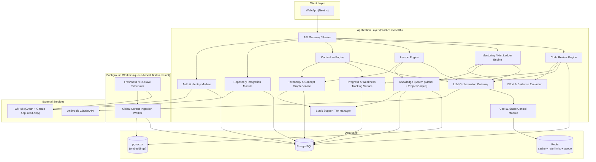
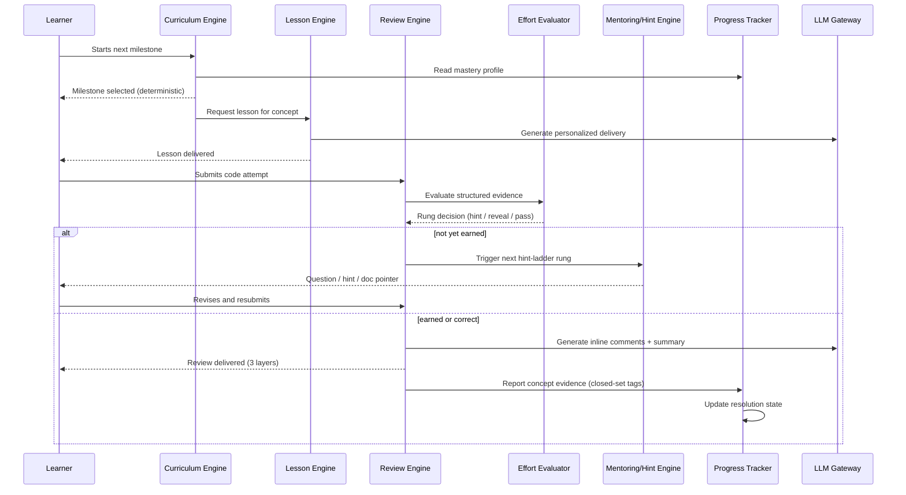

# AI Engineering Workspace — V1 Architecture Document

**Status:** Sprint 0 complete — architecture locked for implementation planning
**Scope:** This document reflects the V1 wedge only. Items explicitly deferred to later versions are called out throughout rather than hidden.

## 0. Product Summary (context for every decision below)

- **What it is:** An AI mentor that teaches intermediate developers (finished 2–3 tutorials, can't yet build independently) to build *any* real project, by teaching instead of generating code.
- **Core philosophy — guided independence:** explain → ask questions → progressive hints → point to docs → review attempt → reveal solution with full reasoning, but only after genuine, evidenced effort. The answer is never forbidden; it is earned.
- **Core differentiator:** Socratic, effort-gated code review and mentoring — not roadmap generation, not RAG. Everything in this architecture is arranged to protect that differentiator and keep everything else in service of it.
- **Governing engineering principle, applied repeatedly below:** *structure what can be structured; let the LLM interpret or narrate within that structure — never let it freely invent, judge, or sequence from scratch.* This single rule shows up in the effort-gate, the concept taxonomy, and the curriculum engine, and is the main reason this architecture is internally consistent rather than a bag of features.

---

## 1. High-Level System Architecture

**Architectural style: a modular monolith, not microservices.**

This is a deliberate trade-off, not a default. Microservices buy you independent scaling and deployment isolation at the cost of distributed-systems complexity (network calls where function calls used to be, eventual consistency, service-mesh operational overhead). A startup validating a novel pedagogical product does not yet know where its real scaling bottlenecks will be — splitting into services now means guessing, and guessing wrong is expensive to undo. A modular monolith with **strict internal module boundaries** gets you 90% of the benefit (clear ownership, testability, replaceable pieces) at a fraction of the operational cost, and the module boundaries below are drawn so that the one component most likely to need independent scaling first — the **ingestion/embedding worker** — is already async and queue-based, making it the cheapest possible thing to extract into its own service later.



**Layers, top to bottom:**
- **Client** — the workspace UI. Owns none of the pedagogy logic; it renders state and forwards intent.
- **Application layer** — the modules described in Sections 2–3. This is where every Sprint-0 decision actually lives.
- **Background workers** — anything that doesn't need to happen inside a request/response cycle: corpus ingestion, scheduled freshness checks. Deliberately isolated behind a queue from day one so it can be pulled out as its own deployable unit without touching the rest of the system.
- **Data layer** — one relational database (Postgres) doing double duty as the vector store (via `pgvector`) for V1. See Section 5 for why a dedicated vector database is not justified yet.
- **External services** — GitHub (identity + read-only repo access) and the LLM provider. Both are treated as untrusted-boundary integrations (validated, rate-limited, never given more trust than necessary).

---

## 2. Core Modules

| Module | One-line purpose |
|---|---|
| Auth & Identity | GitHub OAuth login; owns the platform's internal user identity, decoupled from GitHub |
| Repository Integration | GitHub App install/management; per-repo, read-only, scoped context fetch |
| Curriculum Engine | Deterministic roadmap/milestone sequencing from the taxonomy graph |
| Taxonomy & Concept Graph Service | Owns the canonical concept taxonomy, prerequisites, and stack tiers it maps to |
| Lesson Engine | Assembles personalized lessons from concept metadata + docs + learner profile |
| Mentoring / Hint Ladder Engine | Runs the Socratic ladder: explain → question → hint → docs → reveal |
| Effort & Evidence Evaluator | Collects structured signals, judges "genuine effort," gates ladder progression |
| Code Review Engine | Three-layer PR-style review: inline comments, summary, gated discussion |
| Progress & Weakness Tracking Service | User-scoped mastery profile; resolution state machine |
| Knowledge System | Global corpus (curated docs) + project corpus (live state + retrieval) |
| Stack Support Tier Manager | Curated 🟢/🟡/🔴 capability matrix per stack/version |
| LLM Orchestration Gateway | Single choke point for all model calls; model routing, prompt assembly |
| Cost & Abuse Control | Operation-weighted budgets, caching, rate limiting, graceful degradation |

---

## 3. Responsibilities of Each Module

**Auth & Identity**
Handles GitHub OAuth for sign-in only (`read:user`, `user:email` — nothing else). Issues and owns the platform's own internal `user_id`; GitHub identity is stored as a *linked* identity, not the primary key, so a second login method can be added later without an identity migration. Encrypts OAuth tokens at rest and handles revocation if a user pulls access from GitHub's side.

**Repository Integration**
Manages GitHub App installation, per-repository selection, and read-only token scoping — entirely separate from Auth's login tokens. Fetches only what a given task needs (current file, closely related files, config files, recent diffs) rather than the whole repository. Does not perform any write operations in V1 (no PRs opened, no commits made).

**Curriculum Engine**
Given a project goal and the learner's current mastery profile, deterministically traverses the taxonomy's prerequisite graph to produce milestone order — skipping already-mastered concepts, prioritizing ones flagged as weak. This module **decides what to teach next**; it never asks the LLM to invent a sequence.

**Taxonomy & Concept Graph Service**
The system of record for every canonical concept: prerequisites, mastery criteria, severity, recommended docs, common misconceptions, and which stacks/universal layer it belongs to. Owns the closed set of valid concept IDs. Accepts "unmapped evidence" flags from the Effort Evaluator and Review Engine for human/product review — it is the only thing allowed to evolve the taxonomy; the LLM never modifies it directly.

**Lesson Engine**
Given a milestone, pulls the concept's deterministic metadata, the relevant global-corpus documentation, and the learner's profile, and asks the LLM to generate the *delivery* — explanation, project-specific examples, exercises, reflection questions. Caches the generic (non-personalized) portion of a lesson across users studying the same concept on the same stack, since that content doesn't vary by learner; only the codebase-specific example is generated per user.

**Mentoring / Hint Ladder Engine**
Executes the guided-independence ladder for any point a learner is stuck: concept explanation → guiding questions → progressively specific hints → doc pointers → attempt review → full reveal with reasoning. Every rung transition is gated by the Effort Evaluator, not by conversational persuasion — this module never advances the ladder because a user asked nicely or repeatedly.

**Effort & Evidence Evaluator**
Collects structured signals (submission count, revision diffs, hint-request frequency, doc views, whether prior feedback was actually addressed, self-reported test outcomes) and asks the LLM to synthesize a judgment — *"has this learner demonstrated genuine effort, and what's the next best intervention?"* — from that structured evidence, never from raw chat text alone. This isolation is a deliberate security property: a user cannot argue their way past the gate by wording a chat message persuasively, because the gate doesn't read the chat message directly.

**Code Review Engine**
Produces three linked artifacts per review: inline comments (line- or region-anchored, Socratic by default), a holistic summary (strengths, issues, concepts demonstrated, weaknesses detected, progress toward milestone), and an interactive discussion thread per comment. Critically, discussion-thread replies are routed through the *same* Effort Evaluator gate as direct hint requests — this closes off "just ask a clarifying question instead of resubmitting code" as a way to skip the ladder.

**Progress & Weakness Tracking Service**
Owns the user-scoped mastery profile: one evolving record per (user, concept) pair with confidence score, resolution state (`Detected → Practicing → Improving → Mastered → Monitor`, reversible), and supporting evidence history. This profile follows the user across every project — projects are temporary, mastery is not.

**Knowledge System**
Two independent stores, matched to two different problems:
- *Global corpus* — official documentation for curated stacks, ingested once, version-aware, shared by every user, refreshed on a cadence matched to each framework's release velocity.
- *Project corpus*, split further: **live structured state** (roadmap, current milestone, current code, git metadata — fetched directly from Postgres/the repo, never embedded, because it's small, exact, and known) vs. **retrieval-worthy content** (future user uploads, large repos — deferred past V1, capped to context-fitting scope for now).

**Stack Support Tier Manager**
Maintains the curated 🟢/🟡/🔴 matrix per stack (and per major version, since a stack's tier isn't uniform across its own version history). V1: curated by the product/engineering team. Future: backed by a standardized benchmark suite (curriculum generation, doc Q&A, review quality, debugging assistance, architecture recommendations) re-run periodically so tiers become evidence-driven rather than a one-time guess.

**LLM Orchestration Gateway**
The single place every module goes through to call the model — never called directly by feature modules. Owns prompt assembly, structured-output schema enforcement (Pydantic), and **model routing by operation cost**: cheaper/faster models for high-frequency, low-stakes operations (hints, clarifying questions), the strongest available model for high-stakes operations (full code review, reveal-with-reasoning, architecture feedback). This is also the natural instrumentation point for the cost ledger below.

**Cost & Abuse Control**
Enforces a tier-based daily budget denominated in operation-weighted cost units (hint = low, lesson = medium, review = high), reuses the Effort Evaluator's structured signals to rate-limit "repeated requests with no new evidence" (rather than inventing a second judgment mechanism), and degrades gracefully at quota exhaustion — high-cost generation pauses, but browsing docs, revisiting past lessons, and progress tracking never do.

---

## 4. Data Flow Between Modules

**Core loop — the one that matters most (milestone start through mastery update):**



**Other key flows:**
- **Auth/onboarding:** Client → Auth Module → GitHub OAuth (identity only) → internal user record created → no repo permissions requested yet.
- **Repo connection (separate, contextual):** Client → Repository Integration → GitHub App install flow (per-repo, read-only) → token stored, linked to the specific project, not the user account.
- **Roadmap generation:** Curriculum Engine reads Taxonomy Service (prerequisite graph) + Progress Tracker (what's already mastered) → deterministic milestone list → Lesson Engine narrates each milestone via LLM Gateway.
- **Documentation retrieval:** any module needing context queries in order — structured live state (direct DB read) → project corpus (if any retrieval-worthy content exists) → global corpus (semantic search, version-filtered to the project's declared stack version) → results merged and passed to the LLM Gateway as context.
- **Cost accounting:** every LLM Gateway call reports its operation type and token cost to the Cost & Abuse Control module, which updates the Redis-backed usage ledger in the same request path.

---

## 5. Technology Stack, With Reasons

| Layer | Choice | Why | Alternative considered / trade-off |
|---|---|---|---|
| Frontend | Next.js (App Router) + TypeScript + Tailwind | Server-rendered marketing/onboarding + rich interactive workspace in one framework; also happens to be one of the platform's own curated stacks (dogfooding sharpens the product) | A pure SPA (Vite + React) would be simpler but loses SSR for onboarding/SEO, and the team gains nothing since Next.js is being taught anyway |
| Backend | Python + FastAPI | Heaviest workload is LLM orchestration, structured-output validation, and embeddings — Python's ecosystem (Pydantic, async support, ML/AI tooling) fits directly; Pydantic schemas are the concrete mechanism that enforces "structure what you can" for effort evidence and concept classification | Node/TypeScript backend would unify the language across the stack, but weaker structured-output/embedding tooling for the AI-heavy modules that are the actual product |
| Primary database | PostgreSQL | Relational integrity is non-negotiable for mastery profiles, effort-evidence logs, and billing/quota state — this is exactly the kind of structured, consistency-sensitive data the "database, not vector search" principle was built around | — |
| Vector store | `pgvector` extension on the same Postgres instance | V1's embedding volume is small and bounded (curated global corpus only, no arbitrary ingestion) — running a second database service for this would be infrastructure the current scale doesn't justify | Dedicated vector DB (Pinecone/Qdrant/Weaviate) — revisit when corpus size or query volume outgrows `pgvector`, likely when arbitrary document ingestion ships |
| Cache / rate limiting | Redis | Backs the usage ledger, rate-limit counters, and hot-path caching (doc fragments, session state) — all naturally short-lived, high-read data | — |
| Background jobs | Celery (or `arq`) with Redis as broker | Corpus freshness re-crawls and embedding generation are async, non-request-path work; isolating them behind a queue now is what makes this the easiest module to extract into its own service later | Cron scripts alone would work at tiny scale but don't give retry/observability, and don't set up the extraction path |
| LLM provider | Anthropic Claude, with **model routing by operation cost** | Reasoning/pedagogical quality matters most for the actual differentiator (review, hints); routing cheap/frequent operations (hints, clarifying questions) to a faster/cheaper model and reserving the strongest model for high-stakes operations (full review, reveal-with-reasoning) directly operationalizes the cost-control design in Section 3 | A provider-abstraction layer was considered and deliberately deferred — premature abstraction against a hypothetical future swap, at the cost of slower shipping now |
| Auth | GitHub OAuth (login) + separate GitHub App (repo access) | Matches the least-privilege/progressive-consent decisions from Sprint 0 exactly | Classic OAuth `repo` scope — rejected; grants blanket access to all of a user's repos instead of the one they intend to connect |
| Object storage | S3-compatible bucket | Not required by any V1 feature, but reserved for future user-uploaded PDFs/artifacts so the schema doesn't need rework when that ships | — |

---

## 6. Folder Structure for a Scalable Monorepo

```
ai-engineering-workspace/
├── apps/
│   ├── web/                      # Next.js client — no business logic, renders state
│   └── api/                      # FastAPI application — the modular monolith
│       ├── modules/
│       │   ├── auth/
│       │   ├── repository_integration/
│       │   ├── curriculum/
│       │   ├── taxonomy/
│       │   ├── lessons/
│       │   ├── mentoring/
│       │   ├── effort_evaluation/
│       │   ├── code_review/
│       │   ├── progress_tracking/
│       │   ├── knowledge/          # global corpus + project corpus submodules
│       │   ├── stack_tiers/
│       │   ├── llm_gateway/
│       │   └── cost_control/
│       └── main.py
├── services/
│   └── ingestion_worker/          # queue-consuming worker — first candidate to extract
├── packages/
│   ├── schemas/                   # shared Pydantic/TS types: taxonomy shape, review comment shape, etc.
│   ├── taxonomy-data/              # versioned concept taxonomy content (the curated curriculum itself)
│   └── ui/                        # shared React components
├── infra/
│   ├── docker/
│   └── migrations/                 # Postgres schema migrations
├── docs/
│   ├── architecture/               # this document and future ADRs
│   └── decisions/                  # one file per significant decision, dated
└── docker-compose.yml
```

**Why this shape:** the `modules/` folder inside `apps/api` mirrors Section 2's module list exactly — one-to-one, on purpose, so the org chart of the codebase matches the org chart of the architecture document. `services/` is deliberately separate from `apps/` because it's the one piece expected to become an independently deployed unit; keeping it structurally distinct from day one means "extract this into its own service" is a deployment change, not a rewrite. `packages/schemas` is what makes the monorepo pay for itself — the taxonomy shape, review comment shape, and effort-evidence shape all need to agree between frontend, backend, and (eventually) the extracted worker; a monorepo with shared types prevents them drifting out of sync, which is a real risk given how many modules read and write the same core entities (mastery profile, taxonomy, roadmap).

---

## 7. Database Overview

Grouped by domain rather than listed flat, since the relationships matter more than any single table:

**Identity**
`users` (internal, primary), `github_identities` (linked, 1:1 for V1), `oauth_tokens` (encrypted at rest, scoped to login only).

**Repository**
`repository_connections` (per-project, references the GitHub App installation + selected repo, read-only scope), separate from `oauth_tokens` above — enforcing the auth/authorization separation at the schema level, not just in process.

**Curriculum & Taxonomy**
`concepts` (canonical ID, stack or "universal", severity, mastery criteria, prerequisites as a self-referencing edge table), `stack_versions` (per-framework version awareness), `roadmaps` and `milestones` (generated per project, referencing `concepts`).

**Progress & Mastery** *(user-scoped, not project-scoped — this is the one deliberate exception to "most state lives under a project")*
`user_concept_mastery` (user_id, concept_id, confidence, resolution_state, first_detected, last_observed), `evidence_log` (structured effort signals feeding both the Effort Evaluator and analytics — append-only).

**Review**
`reviews`, `review_comments` (line/region-anchored, or submission-relative for pasted code), `review_discussion_threads` (each gated through the same evidence log as everything else).

**Knowledge**
`global_documents` (metadata: source, stack, version, last_refreshed), `global_embeddings` (pgvector column, one shared index — not duplicated per project), `project_context` (the Layer 2A structured fields, not embedded), and a currently-empty `project_documents`/`project_embeddings` pair reserved for the deferred ingestion feature.

**Platform**
`stack_support_tiers` (stack, version, tier, last_evaluated), `usage_ledger` (user_id, operation_type, cost_units, timestamp — read by Cost & Abuse Control, written by the LLM Gateway).

**Key relationship to hold onto:** `user_concept_mastery` is keyed by `user_id`, everything else pedagogical is keyed by `project_id` — this single distinction is what makes cross-project skill transfer and milestone-skipping possible without special-casing.

---

## 8. API Communication Flow

**Style:** REST over HTTPS, versioned (`/v1/...`), auto-documented via FastAPI's OpenAPI generation — not GraphQL. The access patterns here are mostly "fetch this project's current state" and "submit this action," not the flexible, client-driven querying GraphQL is built for; REST is the simpler tool for the job and simpler is correct at this stage.

**Request lifecycle (typical case — submitting code for review):**
1. Client sends the submission to the API Gateway (`POST /v1/projects/{id}/reviews`).
2. Gateway authenticates the request (session token from Auth module), resolves `project_id` → loads structured live state directly from Postgres.
3. Request is handed to the Code Review Engine, which calls the Effort Evaluator (reads `evidence_log`, no LLM call yet — pure structured judgment).
4. If the gate says "not yet earned," the response returns a hint-ladder step from the Mentoring Engine — this path may not call the LLM Gateway at all for early rungs (explanations of already-authored concept metadata don't need generation).
5. If the gate is satisfied, the Review Engine calls the LLM Gateway once, which assembles context (structured state + relevant global corpus docs, per Section 4's retrieval order), selects the model tier for "code review" (high-cost operation → strongest model), and returns structured output (comments + summary).
6. Review Engine writes `review_comments` and reports evidence back to Progress Tracking, which updates `user_concept_mastery`.
7. Cost & Abuse Control records the operation's cost against the usage ledger in the same transaction.

**External calls, isolated behind two gateways so nothing else touches them directly:**
- **GitHub** — only the Auth module (login) and Repository Integration module (repo read access) ever call GitHub's API. No other module holds a GitHub token.
- **Anthropic** — only the LLM Gateway ever calls the model provider. No module constructs a prompt or parses a completion on its own; this is what makes the cost ledger and structured-output enforcement actually reliable rather than aspirational.

---

## Key Trade-offs Made (summary)

| Decision | Rejected alternative | Why |
|---|---|---|
| Modular monolith | Microservices from day one | Distributed-systems overhead isn't justified before you know your real bottlenecks |
| No code execution in V1 | Sandboxed cloud execution | Removes a serious security surface (sandbox escape, resource abuse) that doesn't serve the core mentoring loop yet |
| No arbitrary document ingestion in V1 | Full RAG platform for any uploaded source | Avoids SSRF/malicious-file/licensing risk before the core mentor is even validated |
| Shared global corpus + per-project live state (not vectorized) | Vectorize everything per project | Avoids redundant embeddings for identical official docs, and avoids embedding data that's already exactly known |
| Deterministic curriculum graph, LLM only narrates | Freeform LLM roadmap generation | The single biggest quality-gate risk from Sprint 0 — a confidently wrong roadmap is worse than a tutorial |
| Closed-set concept taxonomy | Freeform LLM-invented weakness labels | Prevents concept-name drift that would silently break analytics and mastery tracking |
| Effort gate reads structured evidence, not raw chat | LLM judges effort from conversation directly | Resists prompt-injection/persuasion attempts to skip the hint ladder |
| GitHub App (per-repo, read-only) | Classic OAuth `repo` scope | Matches the actual UX promise ("connect *a* repository") instead of silently granting access to everything |

---

## Scalability & Growth Path

**What's deliberately deferred, and the trigger for revisiting each:**
- **Arbitrary document/repo ingestion** → once the core mentoring loop is validated and the security work (SSRF protection, sandboxed parsing, per-user quotas) is funded as its own effort.
- **Full repository semantic indexing** (cross-file retrieval, architecture-aware reasoning) → once context-window-limited analysis is visibly the bottleneck in review quality.
- **Dedicated vector database** → once `pgvector` query latency or corpus size (driven by ingestion shipping) becomes measurable pain, not before.
- **Extracting the ingestion worker into its own service** → the natural first extraction, since it's already queue-isolated; do this before extracting anything pedagogy-related.
- **Real GitHub PR integration** (write access, opening actual PRs) → once collaborative/team features become a priority, which is a different product phase than solo mentoring.
- **Automated, benchmark-driven stack tier evaluation** → once there are enough curated stacks that manual curation is visibly the bottleneck, not before.

**Why this fits a startup that will grow, rather than one that will stall:** every module boundary in Section 2 was drawn along a line that was *already* a natural seam in the Sprint-0 decisions (auth vs. repo authorization, structured state vs. retrieval, deterministic sequencing vs. LLM narration) — not an arbitrary technical split imposed on top. That means the architecture can absorb the deferred features above by filling in an already-reserved slot (an empty `project_documents` table, an already-isolated ingestion worker, an already-separate GitHub App scope) rather than by re-architecting. The expensive mistake this document is built to avoid is the one that's hardest to see coming: building broad, general infrastructure (full RAG, full repo indexing, microservices) before knowing whether the one thing that actually needs to be excellent — the mentoring loop — even works.
