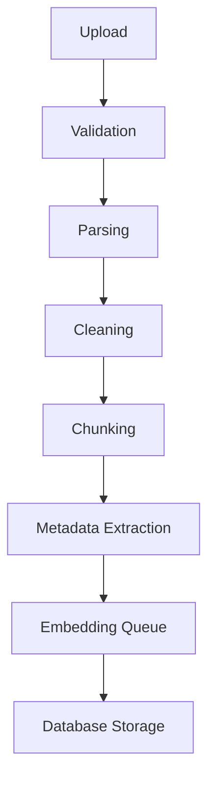
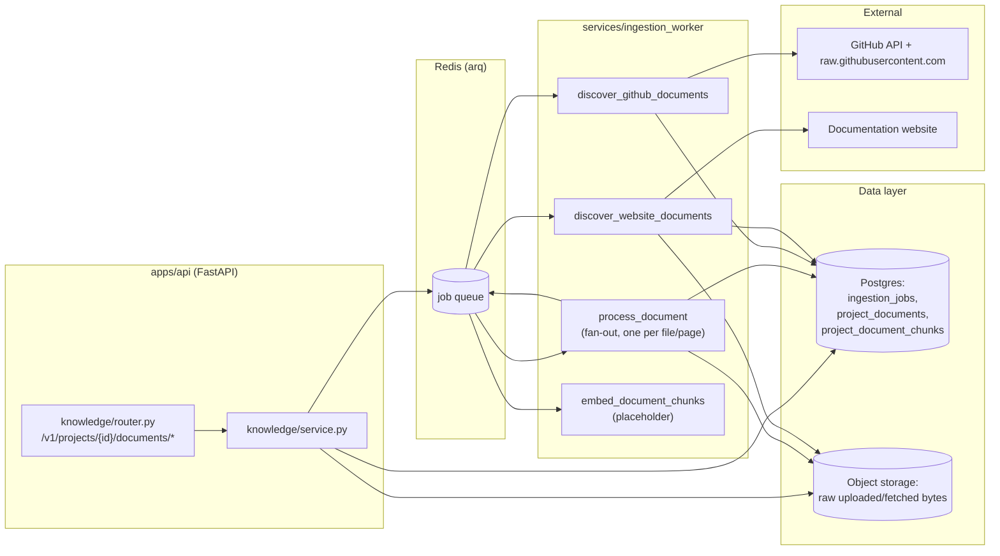
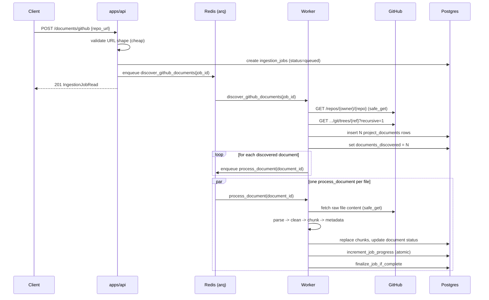
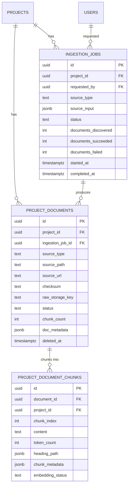

# Documentation Ingestion Engine — V1

**Status:** Implemented — see `apps/api/app/modules/knowledge/` (API surface),
`services/ingestion_worker/` (pipeline + jobs), `packages/object_storage/`
and `packages/schemas/` (shared cross-boundary code). Extends
[`ARCHITECTURE.md`](./ARCHITECTURE.md) Section 3's Knowledge System — this
is the *project corpus* half (per-project, user-supplied documentation);
the *global corpus* (curated docs, shared across every user) is still an
unbuilt stub. Fills in the `project_documents`/`project_embeddings` slot
`ARCHITECTURE.md` Section 7 reserved but explicitly deferred.

**Scope:** Ingests Markdown files, PDFs, public GitHub repositories, and
documentation websites into validated, cleaned, chunked, metadata-tagged
text, durably stored per project. Deliberately stops at "chunks ready to
be embedded" — embedding generation and retrieval/RAG are out of scope
for this pass (see Section 12).

---

## 1. Pipeline



| Stage | Where it runs | What it does |
|---|---|---|
| Upload | `apps/api` (request path) | Accepts a file (multipart) or a GitHub/website URL; validates shape cheaply; stores raw bytes (uploads only); creates `ingestion_jobs`/`project_documents` rows; enqueues a worker job. Synchronous, but deliberately does none of the slow work itself. |
| Validation | Both, in two layers | `apps/api`'s `knowledge/validation.py` does cheap, network-free checks (file magic bytes, URL scheme/host shape) at submission time. The worker's `pipeline/fetch.py` does the expensive, real check — DNS-resolving and IP-validating every hop, including redirects and every crawled link — immediately before each actual fetch. |
| Parsing | `services/ingestion_worker/pipeline/parsers/{markdown,pdf,github,website}.py` | Turns raw bytes into structured text: front-matter + body (markdown), per-page text (PDF), a list of doc files + their raw content (GitHub), a crawled page's main content (website). |
| Cleaning | `pipeline/cleaning.py` | Unicode normalization, whitespace collapsing, and multi-page boilerplate stripping (running PDF headers/footers, repeated website chrome). |
| Chunking | `pipeline/chunking.py` | Splits cleaned text into retrieval-sized, heading-aware pieces (Section 6). |
| Metadata Extraction | `pipeline/metadata.py` + inline in `worker.py` | Attaches document-level (title, page count, repo ref, heading outline) and chunk-level (heading path, page number, code-language hints) metadata (Section 7). |
| Embedding Queue | `services/ingestion_worker` (`embed_document_chunks` job) | Chunks are durably written with `embedding_status='pending'`; a job is enqueued to consume that queue. The job itself is an explicit, documented placeholder — see Section 12. |
| Database Storage | `services/ingestion_worker/db.py` | Chunks (and their document) are written transactionally, delete-then-insert per document — safe to re-run after a crash (Section 9). |

---

## 2. Backend architecture



This is the concrete instance of `ARCHITECTURE.md` Section 1's prediction:
the ingestion worker was already isolated behind a queue from day one, and
this pass is exactly "fill in the placeholder job bodies," not a
redesign. `apps/api` stays a thin, fast request-path layer; every stage
past "enqueue" runs in `services/ingestion_worker`, which remains
importable and deployable independently of `apps/api` (see
`services/ingestion_worker/settings.py`'s extraction-boundary rule —
this pass does not violate it: the worker mirrors its own DB tables in
`db.py` rather than importing `apps.api.app.modules.knowledge.models`,
and shares only `packages/schemas` and `packages/object_storage`, which
are dependency-free of `apps/api`).

**The one real architectural decision this pass makes:** *fan-out
per-document, not per-job.* A `github_repo` or `website` job doesn't
process every file/page in one long-running worker task — discovery
enumerates the full list once, then enqueues one `process_document` job
per file/page. A 500-file repository becomes 500 small, independent,
horizontally-scalable jobs, not one job holding a worker slot for the
duration of the whole repository. This is what Section 11 means by
"scales to large documentation sets": scaling out is adding worker
replicas, not redesigning the pipeline.

### Request/job sequence — GitHub repo ingestion (the most involved path)



Uploads skip the discovery phase entirely (the API already knows the one
document); website ingestion's discovery phase also fetches and stores
each page's HTML directly (Section 9 explains why that's the one
exception to "the worker fetches content in `process_document`").

---

## 3. Database schema



Full column-level detail lives in
`apps/api/app/modules/knowledge/models.py` and the migration
(`apps/api/alembic/versions/202607301000_add_ingestion_engine_tables.py`);
this section covers the design decisions, not a column-for-column repeat.

**Three tables, not one wide table** — same reasoning
`project-workspace-v1.md` already applied to `projects`/`project_settings`/
`recent_projects`: each answers a different question, changes at a
different rate, and is read by a different caller.

| Table | Answers | Written by |
|---|---|---|
| `ingestion_jobs` | *What did the user ask for, and how far along is it?* | `apps/api` (create), worker (every status transition) |
| `project_documents` | *What is this one file/page, and what state is it in?* | worker (discovery creates rows; `process_document` updates them) |
| `project_document_chunks` | *The actual retrieval-sized content and its metadata.* | worker only, via `replace_document_chunks` |

**Why `documents_discovered` is written once, not incremented:** if
discovery streamed `process_document` enqueues *while* still crawling
(interleaving "found a page" with "here's its job"), a fast worker could
finish processing pages 1-10 and ask "are we done yet?" while discovery
is still finding page 11 — the denominator would still be growing. Both
`discover_github_documents` and `discover_website_documents` fully
enumerate the file/page list first, write `documents_discovered` once in
a single `UPDATE`, and only then enqueue every `process_document` job.
After that write, the denominator is fixed for the rest of the job's
life — the only thing that changes is the numerator
(`documents_succeeded + documents_failed`), incremented atomically (see
Section 8).

**Why there's no DB-level uniqueness constraint on
`(project_id, source_type, source_path)`:** a true *partial* unique index
(`WHERE deleted_at IS NULL`) doesn't port cleanly to the SQLite fallback
engine `apps/api`'s test suite uses (see `database-schema-v1.md`'s
identical call for `password_reset_tokens`). "One live document per path"
is documented here as an application-layer invariant for a future
re-ingestion feature to respect, not enforced at the schema level in
this pass — nothing in V1 re-ingests the same path yet, so there's
nothing to violate it today.

**Explicitly deferred: `project_embeddings`.** Mirroring the global
corpus's existing `global_documents`/`global_embeddings` split
(`ARCHITECTURE.md` Section 7), the embedding vector doesn't live on
`project_document_chunks` itself — it's reserved for a separate future
table once an embedding model is actually chosen (dimension count is
part of the column type in `pgvector`, so committing to one now would be
premature). `embedding_status` exists on the chunk row today specifically
so that future migration only has to *add* a table and backfill a status
transition, not alter this one.

---

## 4. Services

`apps/api/app/modules/knowledge/service.py` is deliberately thin — it only
ever does the fast half of the pipeline:

- `create_upload_job` — validates the file (magic bytes, size), computes
  its checksum, stores the raw bytes, writes both `ingestion_jobs` and
  `project_documents` (the document is known immediately for uploads),
  and enqueues `process_document` directly.
- `create_github_job` / `create_website_job` — validate the URL shape,
  write `ingestion_jobs` only (the document list isn't known yet), and
  enqueue the relevant `discover_*` job.
- Reads (`get_job`, `list_jobs`, `get_document`, `list_documents`,
  `list_chunks`) and `delete_document` (soft delete).

Every create path enforces `max_active_ingestion_jobs_per_project` — the
same "plain ceiling, not a full quota system" reasoning
`max_active_projects_per_owner` already established, since ingestion has
no per-operation cost ledger the way LLM calls do (`ARCHITECTURE.md`'s
Cost & Abuse Control module).

---

## 5. Why chunking matters

An embedding model compresses a piece of text into one fixed-size vector.
Feed it a whole 20-page guide and the vector represents "the average of
everything in this document" — useful for almost no specific query. Feed
it one sentence and the vector has no surrounding context to disambiguate
it. Chunking is choosing the unit in between: large enough to be a
coherent, self-contained idea; small enough that its vector actually
means something specific. Three concrete decisions this pipeline makes
because of that:

1. **Heading-aware, not fixed-size.** `chunk_markdown_like` splits on
   paragraph/heading boundaries and forces a chunk boundary at every
   heading transition — a chunk never straddles two sections, so its
   `heading_path` metadata is never mislabeled, and a reader (or a future
   retriever) never gets half of "Installation" glued to half of
   "Configuration."
2. **Code blocks are atomic.** A fenced code block is never split mid-line
   if it fits in a chunk at all — splitting `pip install foo` across a
   chunk boundary produces two useless fragments instead of one useful
   instruction.
3. **Overlap carries context across the boundary.** Each chunk after the
   first begins with a tail of the previous chunk's text
   (`chunk_overlap_tokens`, default ~100 tokens). Without it, a sentence
   that happens to fall right at a chunk boundary loses whatever
   qualified it half a sentence earlier.

Token counts throughout are `len(text) // 4` — a documented approximation
(English averages roughly 4 characters per token across common
tokenizers), not a real tokenizer dependency. Nothing downstream needs an
exact count yet (no embedding model is wired up — Section 12); swap in
the real tokenizer for whichever model is eventually chosen, behind
`pipeline.chunking.approx_token_count`'s same signature.

PDFs get a separate, simpler chunker (`chunk_pdf_pages`): text extraction
from a PDF has no reliable heading structure to key off of, so the page
is the section unit instead, and every chunk carries a real
`page_number`.

---

## 6. Metadata strategy

Metadata is captured at two levels, because a document-level fact
("this PDF has 40 pages") and a chunk-level fact ("this chunk is from
page 12") answer different questions and are read by different callers.

| Level | Field | Source types | Purpose |
|---|---|---|---|
| Document (`doc_metadata`) | `page_count` | PDF | Progress/UI display |
| Document | `heading_outline` | markdown, github (`.md`) | Table-of-contents rendering without re-parsing |
| Document | `front_matter` | markdown | Author-supplied tags/description carried through |
| Document | `repo`, `ref` | github_repo | Provenance — which repo/branch/commit this came from |
| Document | `pdf_title` | PDF | Falls back to filename if absent |
| Chunk (`chunk_metadata`) | `heading_path` | markdown, github, website | Section breadcrumb (`["Guide", "Installation"]`) |
| Chunk | `page_number` | PDF | Which page this chunk's text came from |
| Chunk | `url_anchor` | website | Best-effort deep-link slug for the chunk's heading |
| Chunk | `is_code_heavy` | all | Whether this chunk is predominantly code (a useful filter later) |
| Chunk | `chunk_position` | all | Sequential order within the document |

**Why website pages reuse the markdown chunker instead of a third
implementation:** `pipeline/parsers/website.py` converts each crawled
page's HTML into the same heading-prefixed, fenced-code-block plain text
that markdown files already are — `<h1>`-`<h6>` become `#`-`######`
prefixed lines, `<pre>` becomes a fenced block, nav/footer/script/style
are stripped first. One heading-aware chunker then serves both source
types; only PDF's fundamentally different (page-based, no headings)
structure earns its own chunker.

---

## 7. API endpoints

All nested under `/v1/projects/{project_id}/documents`, reusing
`projects.dependencies.get_owned_project` for ownership enforcement (same
404-not-403 enumeration-safety property every other project-scoped route
already has):

| Method | Path | Purpose |
|---|---|---|
| `POST` | `/uploads` | Upload a markdown/PDF file (multipart) |
| `POST` | `/github` | Submit a public GitHub repo URL |
| `POST` | `/website` | Submit a documentation website URL |
| `GET` | `/jobs` | List this project's ingestion jobs |
| `GET` | `/jobs/{job_id}` | One job's status/progress |
| `GET` | `` (list) | List this project's documents (filter by `source_type`/`status`) |
| `GET` | `/{document_id}` | One document's metadata/status |
| `GET` | `/{document_id}/chunks` | A document's chunks (paginated) — useful for inspection even with no retrieval built yet |
| `DELETE` | `/{document_id}` | Soft delete a document |

---

## 8. Worker structure

`services/ingestion_worker/worker.py`'s `WorkerSettings.functions`:

| Job | Retries | Purpose |
|---|---|---|
| `discover_github_documents` | 2 | List a repo's doc files, create `project_documents` rows, fan out |
| `discover_website_documents` | 2 | Crawl a site, store each page's HTML, create rows, fan out |
| `process_document` | 3 | Validate → parse → clean → chunk → extract metadata → store, for one document |
| `embed_document_chunks` | default | Placeholder — see Section 12 |
| `ingest_document`, `refresh_global_corpus` | — | Pre-existing global-corpus placeholders, unrelated to this pass |

Discovery jobs retry sparingly: a `github_repo`/`website` submission that
still fails after one retry is almost always a permanent problem (bad
URL, private repo, unreachable site), not a network blip worth hammering
the source over. `process_document` retries more, since across
potentially hundreds of independent per-file/per-page jobs, transient
one-off fetch failures are the dominant failure mode, not systemic ones.

---

## 9. File storage strategy

Object storage (`packages/object_storage`, an `ObjectStorage` Protocol
with `S3ObjectStorage` and `LocalObjectStorage` implementations) holds
every piece of raw content this pipeline ever fetches or accepts, keyed
as:

```
projects/{project_id}/ingestion/{job_id}/{document_id}/original.{ext}
```

- **Uploads** (markdown/PDF): `apps/api` writes the raw bytes at upload
  time, before the worker ever runs.
- **Website pages**: `discover_website_documents` writes each page's raw
  HTML *during discovery* — the crawl already has to fetch the full page
  to find outgoing links, so storing it then is the one and only network
  fetch for that page; `process_document` just reads it back.
- **GitHub files**: discovery only lists paths and sizes via the tree
  API (fetching every file's content during discovery would mean holding
  potentially hundreds of files in memory at once); `process_document`
  fetches and stores each file's content the first time it's actually
  processed.

**Backend selection** (`OBJECT_STORAGE_BACKEND=local|s3`): `local` writes
under a directory on disk — used for host-only dev and the test suite,
the same "cheaper backend behind the same interface" pattern
`tests/conftest.py` already uses for SQLite-instead-of-Postgres. `s3`
talks to any S3-compatible endpoint — real AWS S3 in production, and
`docker-compose`'s `minio` service locally (only `endpoint_url` differs),
so local Docker Compose dev exercises the exact same code path production
does.

**What's deferred:** deleting a document (`DELETE /{document_id}`) is a
soft delete only — the raw object at `raw_storage_key` is left in place.
Actual storage reclamation is a reaper-job concern, the same category as
the `sessions`/`*_tokens` reaper noted (but not yet built) in
`database-schema-v1.md` — not implemented in this pass.

---

## 10. Error handling

Two exception base classes (`pipeline/errors.py`) carry the retry
decision at the point an error is raised, rather than worker.py having to
pattern-match error messages after the fact:

- **`RetryableIngestionError`** — transient (timeout, 5xx, connection
  reset). Left to propagate **uncaught** out of a job function, so arq's
  own `max_tries`/backoff takes over.
- **`PermanentIngestionError`** — will never succeed no matter how many
  times it's retried (404, invalid URL, unsupported file type, a hard
  size/count limit exceeded). Always caught by the job function itself
  and recorded as a `failed` status — never re-raised, so a retry is
  never wasted on it.

**Per-document isolation:** one document failing (a corrupt PDF, a 404'd
file, an oversized page) never aborts the rest of the job.
`process_document` catches `PermanentIngestionError` for its *own*
document only, records that document `failed`, and reports the outcome
to the job via `increment_job_progress` — an atomic
`UPDATE ... RETURNING`, which is what makes "am I the last document for
this job" race-free under concurrent workers: Postgres serializes
concurrent updates to the same row, so exactly one caller's `RETURNING`
observes the terminal count first. `finalize_job_if_complete` then sets
the job's terminal status based on the mix of outcomes:

| Outcome | Job status |
|---|---|
| All documents succeeded | `completed` |
| Some succeeded, some failed | `completed_with_errors` |
| All documents failed (or zero were ever discovered) | `failed` |

**Idempotency:** `replace_document_chunks` deletes a document's existing
chunks and re-inserts the new set in one transaction. A retried
`process_document` (after a mid-pipeline crash) always ends with exactly
one row per `chunk_index` — never duplicates.

**SSRF defense in depth:** `apps/api`'s `knowledge/validation.py` rejects
obviously-unsafe URLs at submission time (cheap, no DNS resolution in a
request handler). The worker's `pipeline/fetch.py` is the real
enforcement point — it resolves and validates the IP of *every* hop
(the root URL, every redirect `Location`, every crawled link) immediately
before each individual request, which is what actually defeats DNS
rebinding; a hostname's validity when submitted says nothing about what
it resolves to moments later, or after a redirect to an entirely
different host.

---

## 11. Why ingestion is asynchronous

Every source type this pipeline supports has an unbounded, slow, or
externally-dependent step: parsing a PDF, cloning/listing a large
repository, crawling up to 200 pages of a website. None of that belongs
inside an HTTP request/response cycle — a client shouldn't hold a
connection open for minutes waiting on a website crawl, and a slow
upstream (GitHub rate-limited, a website timing out) shouldn't be able to
tie up an API worker process. `apps/api`'s side of every ingestion
endpoint does only the fast, bounded part (store bytes, write a couple of
rows, enqueue) and returns immediately with a job the client can poll —
exactly the same shape `ARCHITECTURE.md` Section 1 called out from the
start: "the ingestion/embedding worker is already async and queue-based,
making it the cheapest possible thing to extract into its own service
later." This pass is that prediction being fulfilled, not revisited.

---

## 12. How this scales to large documentation sets

- **Fan-out, not one job per source.** Section 2's sequence diagram is
  the whole answer: a 500-file repo or a 200-page site becomes hundreds
  of independent `process_document` jobs. Adding worker replicas
  (`docker-compose`'s `worker` service, scaled horizontally) directly
  increases ingestion throughput — there's no single long-running task
  that a second replica can't help with.
- **Hard ceilings, not best-effort limits.** `ingestion_max_github_files`,
  `ingestion_max_github_repo_bytes`, `ingestion_max_website_pages`,
  `ingestion_max_website_crawl_depth`, and `ingestion_max_upload_bytes`
  are all enforced *before* the expensive work starts (repo size is
  checked from the GitHub API's metadata response, before any file is
  fetched) — a caller can't accidentally (or deliberately) queue
  unbounded work.
- **Per-project job ceiling** (`max_active_ingestion_jobs_per_project`)
  bounds how much of the queue any single project can occupy at once,
  the same "plain ceiling" reasoning `max_active_projects_per_owner`
  already established for project creation.
- **Storage and DB writes are already the right shape for growth.**
  `project_document_chunks` has an index on
  `(project_id, embedding_status)` — built now specifically for the
  query a future embedding worker will run ("give me this project's
  chunks still waiting to be embedded"), so that worker's first query
  doesn't need a schema change to be efficient. Chunks and the raw bytes
  they came from are content-addressed (checksums), giving reprocessing
  a real "did this change" check to build on later, without redesigning
  the storage keys.
- **Next scaling trigger, per `ARCHITECTURE.md`'s existing growth path:**
  once corpus size or query volume (driven by this pass shipping) makes
  `pgvector` query latency measurable pain, that's the trigger for a
  dedicated vector database — not before, and not a decision this pass
  needs to make.

---

## 13. Explicitly deferred

Consistent with the brief for this pass ("do not implement retrieval or
RAG yet"), and following the same "build the seam, not the feature"
pattern already established elsewhere in this codebase (an empty-but-real
router per module, a placeholder `ingest_document`/`refresh_global_corpus`
job):

- **Embedding generation.** `embed_document_chunks` is a real, wired-up
  arq job — enqueued at the end of every successful `process_document`
  run — but its body is an explicit placeholder, matching the existing
  stub style. Chunks are already durably stored with
  `embedding_status='pending'` by the time it would run.
- **`project_embeddings` table / pgvector column.** Deliberately not
  created in this migration (Section 3) — committing to a vector
  dimension before an embedding model is chosen would be premature.
- **Retrieval / RAG.** No query endpoint, no semantic search, no
  connection to the Mentoring/Lesson engines. `GET /{document_id}/chunks`
  exists only for inspecting what the pipeline produced, not for
  retrieval.
- **Storage reclamation reaper.** Soft-deleted documents leave their raw
  object in storage; a cleanup job is future work (Section 9).
- **A real tokenizer.** `approx_token_count` is a documented `chars // 4`
  heuristic; swap in the real tokenizer for whichever embedding model
  ships, behind the same function signature (Section 5).
- **Document re-ingestion / refresh.** Submitting the same GitHub repo or
  website again today creates a brand-new `ingestion_jobs` row and a
  parallel set of documents rather than updating the existing ones —
  "one live document per path" is documented as an application-layer
  invariant for a future pass to enforce (Section 3), not built yet.
