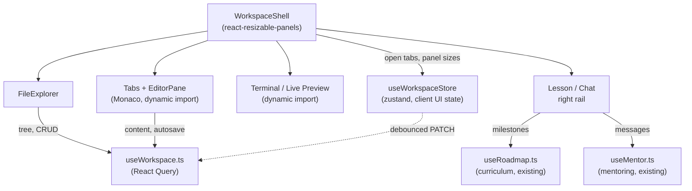

# Interactive Learning Workspace — V1

**Status:** Implemented — see `apps/api/app/modules/workspace/` (models,
service, router) and `apps/web/src/components/workspace/` (Monaco
editor, file explorer, tabs, split layout, lesson panel, AI chat, live
preview, terminal). Builds on `ARCHITECTURE.md`'s Client layer and
[`project-workspace-v1.md`](./project-workspace-v1.md)'s `projects`
table. Reuses, rather than re-implements, two already-shipped engines:
[`curriculum-engine-v1.md`](./curriculum-engine-v1.md)'s
`roadmap_router` (Lesson Panel) and
[`mentor-engine-v1.md`](./mentor-engine-v1.md)'s `mentor_router` (AI
Chat) — this doc adds no new backend surface for either.

**Scope:** A VS-Code-shaped in-browser IDE per project: Monaco editor,
a file tree backed by real per-project file storage, tabs, a resizable
split layout, autosave with conflict detection, and workspace
persistence (open tabs/panel sizes survive a reload). **Not** in this
pass: server-side execution of learner code. See §1 for why, and the
"Explicitly deferred" table at the end for the concrete trigger to
revisit it.

---

## 1. Why this shape (read before the schema)

`ARCHITECTURE.md`'s trade-off table already made a call here:

> No code execution in V1 | Sandboxed cloud execution | Removes a
> serious security surface (sandbox escape, resource abuse) that
> doesn't serve the core mentoring loop yet

"Live Preview" and "Terminal Integration" read at face value both mean
*running the learner's code somewhere*. Two ways to honor the letter of
that request without silently reopening a deliberate security decision
that has real compute/isolation/billing consequences nobody has signed
off on yet:

- **Live Preview ships real, today, entirely client-side.** An HTML
  file's content renders directly in a sandboxed `<iframe
  sandbox="allow-scripts">` via `srcDoc` — no `allow-same-origin`, so
  the preview can run scripts but can never read/write the parent page,
  cookies, or storage. Same-workspace `<link rel="stylesheet">`/`<script
  src>` references are inlined client-side (`LivePreviewPanel.tsx`) so
  a multi-file HTML/CSS/JS lesson genuinely live-previews. This is a
  real, working feature for exactly the stack most lessons will
  actually preview (rendered markup) — it just never involves a server.
- **Terminal Integration ships as real, working UI with execution
  explicitly deferred.** `TerminalPanel.tsx` is a real `xterm.js`
  instance, not a simulated shell — it just never sends a command
  anywhere; every `Enter` gets the same honest response instead of
  DevAtlas faking output. This is the same "reserve the real shape, ship
  the routes later" pattern the codebase already uses for stub routers
  (`lessons/router.py`), applied to a frontend component instead of an
  API.

Both are judged in code review terms as "the lazy, correct-sized
version of what was asked" rather than a silent scope cut: they satisfy
the actual product need (see your HTML/CSS run, have a terminal
present) without inventing a sandboxing story this step was never
asked to design.

**Two more scope reductions, because the functionality already exists
elsewhere:**

- **Lesson Panel** renders `curriculum.roadmap_router`'s
  `MilestoneDetailRead` (`explanation`, `key_points`, `exercises`,
  `quiz`) directly — no workspace-owned lesson data.
- **AI Chat** renders `mentoring.mentor_router`'s conversation — no
  workspace-owned chat data. It reuses the existing
  `useSessionStore.currentMilestoneId` (not a new workspace concept) as
  the optional concept anchor for a message, so "which milestone am I
  on" stays one fact shared across the whole app, not duplicated
  per-feature.

So the only genuinely new backend surface, and the only new tables, are
**file storage** and **workspace layout persistence**.

---

## 2. Database design

### 2.1 `workspace_files`

| Column | Type | Notes |
|---|---|---|
| `id` | `UUID PK` | `gen_random_uuid()` |
| `project_id` | `UUID NOT NULL FK → projects(id) ON DELETE CASCADE` | |
| `path` | `TEXT NOT NULL` | POSIX-style, e.g. `src/index.html`. Shape validated in `schemas.py` (no leading `/`, no `.`/`..` segments), matching the `projects.name` precedent of keeping this in Pydantic, not a DB `CHECK` |
| `content` | `TEXT NOT NULL DEFAULT ''` | Lives directly in Postgres — see below |
| `content_hash` | `TEXT NULL` | Server-computed sha256 hex digest, recomputed on every write |
| `size_bytes` | `INTEGER NOT NULL DEFAULT 0` | Server-computed `len(content.encode())`, enforced against `workspace_file_max_bytes` |
| `created_at` / `updated_at` | `TIMESTAMPTZ` | `updated_at` trigger-maintained, same `set_updated_at()` function every other table uses |

**`UNIQUE(project_id, path)`** — no separate index needed; Postgres
backs the unique constraint with one.

**Deliberately no `is_directory` column, and no "create folder"
endpoint.** Folders are derived from flat `path`s at render time
(`FileExplorer.tsx`'s `buildTree`), the same way a git tree view or
GitHub's file browser works — a folder exists exactly when a file
lives under it, and disappears the moment the last one is renamed or
deleted out. This isn't a corner cut for time: modeling directories as
rows buys nothing here (empty folders aren't a real product need for a
lesson's file tree) and costs a second entity with its own create/
rename/delete-cascade rules to get right.

**Storage choice — a Postgres `TEXT` column, not the `ObjectStorage`/
MinIO abstraction the Ingestion Engine uses for uploaded documents.**
That abstraction is the right tool for the documents it stores
(arbitrary-size uploads, written once). Code files here are KB-sized
and rewritten on every autosave; round-tripping every keystroke through
MinIO adds a network hop and a second failure mode for no benefit at
this size. A `TEXT` column keeps Postgres the single source of truth —
already true for every other module — and is trivially fast enough for
source-file-sized content.

### 2.2 `workspace_layouts`

1:1 with `projects` — same shape as `project_settings`
(`project-workspace-v1.md` §2.2): PK **is** the FK, created lazily on
first read/write (mirrors `mentoring.service.get_or_create_conversation`)
rather than transactionally alongside the project, since most projects
won't have their workspace opened the moment they're created.

| Column | Type | Notes |
|---|---|---|
| `project_id` | `UUID PK FK → projects(id) ON DELETE CASCADE` | |
| `open_tabs` | `JSONB NOT NULL DEFAULT '[]'` | Ordered array of `workspace_files.id` (as strings — JSONB array elements can't carry a real FK) |
| `active_tab_id` | `UUID NULL FK → workspace_files(id) ON DELETE SET NULL` | A real FK, unlike `open_tabs` — deleting the active file auto-clears this at the DB level, same pattern as `Message.milestone_id`. `service.delete_file` also clears it (and prunes `open_tabs`) in application code, so correctness never depends on FK enforcement being switched on for every target dialect (Postgres always is; the SQLite test fallback isn't by default) |
| `panel_sizes` | `JSONB NOT NULL DEFAULT '{}'` | `{"explorer": 18, "rightRail": 25, "bottomPanel": 30}` — percentages from `react-resizable-panels`' `onLayout` |
| `bottom_panel_visible` | `BOOLEAN NOT NULL DEFAULT false` | |
| `right_rail_tab` | `TEXT NOT NULL DEFAULT 'lesson'` | `CHECK IN ('lesson', 'chat')` |
| `bottom_panel_tab` | `TEXT NOT NULL DEFAULT 'terminal'` | `CHECK IN ('terminal', 'preview')` |
| `updated_at` | `TIMESTAMPTZ` | trigger-maintained |

### 2.3 ER diagram

```mermaid
erDiagram
    PROJECTS ||--o{ WORKSPACE_FILES : "contains"
    PROJECTS ||--|| WORKSPACE_LAYOUTS : "has"
    WORKSPACE_FILES ||--o| WORKSPACE_LAYOUTS : "active tab (SET NULL)"

    WORKSPACE_FILES {
        uuid id PK
        uuid project_id FK
        text path
        text content
        text content_hash
        int size_bytes
        timestamptz created_at
        timestamptz updated_at
    }

    WORKSPACE_LAYOUTS {
        uuid project_id PK_FK
        jsonb open_tabs
        uuid active_tab_id FK
        jsonb panel_sizes
        bool bottom_panel_visible
        text right_rail_tab
        text bottom_panel_tab
        timestamptz updated_at
    }
```

---

## 3. Backend API

Two routers per the codebase's established convention — an empty stub
(`router`, `/v1/workspace`, reserved the same way `lessons/router.py`
is) and the real nested router (`workspace_files_router`,
`/v1/projects/{project_id}/workspace`), every handler behind
`Depends(get_owned_project)`:

| Method | Path | Notes |
|---|---|---|
| `GET` | `/tree` | Metadata only (`id`, `path`, `size_bytes`, `updated_at`) — no `content`, so opening a workspace is O(files), not O(bytes) |
| `POST` | `/files` | Validates path shape, `max_workspace_files_per_project`, `workspace_file_max_bytes` |
| `GET` | `/files/{id}` | Full detail, including `content`/`content_hash` |
| `PATCH` | `/files/{id}` | `{content, expected_content_hash?}` → 409 on a stale hash (§5) |
| `PATCH` | `/files/{id}/path` | Rename/move — same op, since `path` is the file's identity |
| `DELETE` | `/files/{id}` | |
| `GET` / `PATCH` | `/layout` | Lazily created; `PATCH` is a partial update (`exclude_unset`), same idiom as `ProjectSettingsUpdate` |

Config additions (`app/core/config.py`), same "simple ceiling, not a
full quota system" reasoning as `max_active_projects_per_owner`:
`max_workspace_files_per_project` (300), `workspace_file_max_bytes`
(256 KB).

---

## 4. Frontend architecture



**State management split follows the rule `useSessionStore.ts` already
documents: React Query owns server data, zustand owns client-only UI
state.** Concretely:

- **React Query** (`hooks/useWorkspace.ts`, `useRoadmap.ts`,
  `useMentor.ts`): file tree, file content, layout, lesson content,
  chat messages. Mutations patch the cache directly (`setQueryData`)
  rather than invalidating on the hot paths — autosave and layout
  writes happen far too often to justify a full refetch each time; only
  create/rename/delete (rare) invalidate the tree.
- **zustand** (`store/useWorkspaceStore.ts`): open tab order, active
  tab, right-rail/bottom-panel tab selection, and each open tab's
  uncommitted keystroke buffer. Hydrated once from the `workspace_layouts`
  React Query data on load (guarded by a ref so a later background
  refetch never stomps state the user has since changed locally), then
  evolves locally and is written back through React Query's mutation,
  not zustand persist middleware — the backend row already is the
  persistence.
- **Monaco and xterm.js are both `next/dynamic(..., { ssr: false })`.**
  Both reach for the DOM/`window` directly and are multi-MB bundles;
  keeping them out of every other route's bundle (and off the server
  render entirely) is a real, measurable win, not a defensive habit.

**Library choice worth flagging:** `react-resizable-panels` is pinned
to `^2.1.9`, not the current `4.x` line. `4.x` renamed the entire public
API (`PanelGroup`/`PanelResizeHandle` → `Group`/`Separator`) very
recently; `2.x` is what virtually every existing example, and shadcn/ui's
own "resizable" component, is built against. Boring and documented beat
newest for a layout primitive the whole workspace sits on.

---

## 5. File synchronization strategy

Each open tab holds a per-tab in-memory "dirty" buffer (a plain
`useRef` inside `EditorPane`, not React Query or zustand — genuinely
ephemeral, one editor instance's uncommitted keystrokes). An ~800ms
debounce after the last keystroke flushes `PATCH /files/{id}` with the
`content_hash` the client last fetched (`expected_content_hash`).
Additional flush triggers, so no more than ~800ms of typing is ever at
risk: tab close, tab switch away (both via `EditorPane`'s unmount
effect — the component is deliberately remounted per file, `key={fileId}`,
rather than kept alive and fed a new file, so its refs are never valid
for more than one file at a time), and `beforeunload`.

The server recomputes the hash server-side and returns `409
Conflict` if it has moved since the client last read it — the client
surfaces "this file changed since you last loaded it" rather than
silently overwriting. This is deliberately **last-write-wins-with-a-
warning, not a merge algorithm**:
[`project-workspace-v1.md`](./project-workspace-v1.md) already scoped
V1 projects as single-owner, so a real conflict can only come from the
same user in two tabs or two devices — a warning is the proportionate
response; a merge algorithm would be solving a problem that doesn't
exist yet (see §7 for what does replace this once that stops being
true).

Workspace layout (open tabs, panel sizes, which right-rail/bottom-panel
tab is active) follows the identical shape: local zustand state changes
immediately for a responsive UI, debounced 500ms, then `PATCH
/layout` — same reasoning, smaller stakes.

---

## 6. Why this scales / performance considerations

- **No new service.** The workspace module is one more slice of the
  same modular monolith `ARCHITECTURE.md` already committed to — no
  new deployment unit, no new operational surface.
- **`/tree` is metadata-only.** Opening a workspace costs O(number of
  files), never O(total bytes) — content is fetched lazily, per tab,
  only for files actually opened.
- **Per-project ceilings bound the worst case** the same way
  `max_active_projects_per_owner`/`ingestion_max_upload_bytes` already
  do elsewhere: `max_workspace_files_per_project` (300),
  `workspace_file_max_bytes` (256 KB) — this never grows into "we
  accidentally built a second object store" territory.
- **Debouncing bounds write rate independent of input speed.** Autosave
  (800ms) and layout persistence (500ms) both mean a user typing at any
  speed, or dragging a resize handle back and forth, produces a bounded
  number of writes, not one per keystroke/pixel.
- **Monaco/xterm are code-split**, not loaded on every route (§4).
- **React Query's cache-patching over invalidation** on the hot autosave
  path avoids a full tree refetch on every save; `staleTime` on the
  tree/layout queries avoids redundant refetches on tab switches within
  the same session.

---

## 7. Future collaborative editing support

The per-file, single-`TEXT`-column model is deliberately CRDT-ready at
the granularity that matters, without having been over-built for it
today. `(project_id, path)` → one row is already the natural key for
"one collaboration room per file." A future real-time collaboration
phase would:

1. Replace the `content_hash` optimistic-concurrency write path with a
   CRDT document (e.g. Yjs) per file, synced over a WebSocket relay —
   no schema redesign needed, just an additive `y_doc_state BYTEA NULL`
   column.
2. Demote Postgres from "source of truth on every keystroke" to
   "periodic CRDT snapshot" — the same role `conversations.summary`
   already plays as a compaction snapshot in
   [`mentor-engine-v1.md`](./mentor-engine-v1.md), not a new pattern
   for this codebase.
3. Replace `service.update_file_content`'s single-writer conflict check
   with the CRDT's own merge — the 409-on-stale-hash path this doc
   ships today is exactly the thing that stops being necessary once
   concurrent writers are a real, supported case rather than a same-
   user-two-tabs edge case.

This isn't built now because nothing in this step's scope needs it —
`project-workspace-v1.md` scopes V1 projects as single-owner, so there
are no real concurrent collaborators to serve yet. Building the CRDT
plumbing ahead of that would be exactly the kind of unrequested
abstraction the rest of this codebase's docs are careful to call out
and avoid.

---

## 8. Explicitly deferred, and the trigger for each

| Deferred | Trigger to revisit |
|---|---|
| Server-side code execution (real Terminal command execution, dev-server-backed Live Preview for non-static stacks) | A sandboxed execution runtime (Firecracker/gVisor/Docker-based, or a hosted service) is chosen **and** signed off on the security review that decision needs — this is the same "no code execution in V1" line `ARCHITECTURE.md` already drew, not a new one |
| Real-time collaborative editing | A product surface actually needs a second concurrent editor on the same project — see §7 for the schema seam already in place |
| Binary/asset files in the workspace (images, etc.) | A lesson needs to ship something that isn't text — at that point `workspace_files.content` should move to the `ObjectStorage` abstraction for that file, not before |
| Directory-as-a-first-class-concept (empty folders, folder rename as one op) | A lesson genuinely needs an empty folder to exist before any file is created in it — hasn't come up |
