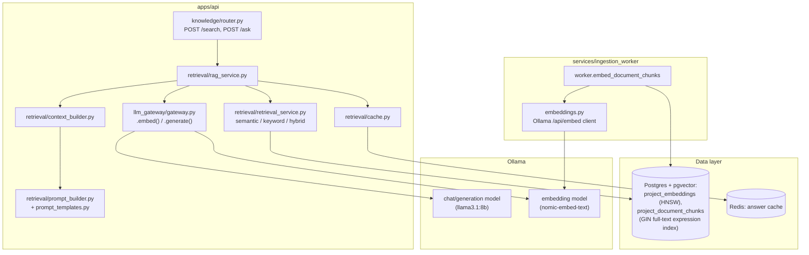

# RAG Knowledge Engine — V1

**Status:** Implemented — see `apps/api/app/modules/knowledge/retrieval/`
(retrieval, context/prompt building, orchestration, caching),
`apps/api/app/modules/llm_gateway/` (embedding support added to the
existing gateway), and `services/ingestion_worker/embeddings.py` +
`worker.py`'s `embed_document_chunks` (the ingestion-side embedding
step, now implemented for real). Builds directly on
[`ingestion-engine-v1.md`](./ingestion-engine-v1.md), which stopped at
"chunks durably stored with `embedding_status='pending'`" and explicitly
deferred everything past that point — this document is that deferred
work.

**Scope:** PostgreSQL + pgvector, semantic search, metadata filtering,
hybrid (vector + keyword) retrieval, a context builder, a prompt
builder, and Ollama integration for both embeddings and generation.
Retrieval and answer generation are exposed as `/search` and `/ask`.
There is still no connection into the Mentoring/Lesson engines
(`ARCHITECTURE.md`'s pedagogy modules) — this is the retrieval
*capability*, not yet wired into the product's teaching loop.

---

## 1. Backend architecture

**Where each new piece lives, and why:**
- Retrieval is a **new subpackage**
  (`app/modules/knowledge/retrieval/`) inside the existing `knowledge`
  module, not a new top-level module — it's the other half of the
  Knowledge System's *project corpus* story (`ARCHITECTURE.md` Section
  3), operating on the exact tables the ingestion engine already owns.
- **Embeddings have two, deliberately separate, call sites.**
  Query-time embedding (embed the user's question at request time) goes
  through `llm_gateway.LLMGateway.embed()` — the same single choke
  point every other model call in this app already uses. Ingestion-time
  embedding (embed every chunk once, right after `process_document`
  finishes chunking it) happens in the worker via its own
  `embeddings.py`, independent of `llm_gateway` entirely — the worker
  must never import `apps/api` (see
  `services/ingestion_worker/settings.py`'s extraction-boundary rule,
  unchanged by this pass). Both sides agree only on the model name
  (`OLLAMA_EMBEDDING_MODEL`) and vector width
  (`schemas.EMBEDDING_DIMENSIONS`), the same "duplicate deliberately,
  never import across the boundary" pattern the rest of the worker
  already follows for its DB access (`db.py`) and settings.
- **The context/prompt builders are pure functions**, not services —
  no DB, no network, easy to unit test in isolation (see
  `tests/test_context_builder.py`, `tests/test_prompt_builder.py`).
  `rag_service.py` is the only thing that wires them together with a
  real DB session, cache, and LLM gateway.

---

## 2. Database: PostgreSQL + pgvector

Two additions, both in `apps/api/alembic/versions/202607301800_add_rag_knowledge_engine.py`:

- **`project_embeddings`** — one row per chunk (1:1, `chunk_id` unique),
  holding a `vector(768)` column and an HNSW index
  (`USING hnsw (embedding vector_cosine_ops)`) for approximate nearest-
  neighbor search. Split from `project_document_chunks` for the reasons
  in that model's own docstring: text and embedding have different
  write patterns and different futures (re-embedding after a model
  change touches only this table).
- **A GIN expression index** on
  `to_tsvector('english', project_document_chunks.content)` — no new
  column. Postgres can index an expression directly; `retrieval_service.py`'s
  keyword-search query uses the *identical* expression, so the index
  and the query can never drift out of sync the way a separately
  maintained generated column and a hand-written query sometimes do.

Both are Postgres-only mechanisms with no SQLite equivalent — consistent
with `database-schema-v1.md`'s already-established pattern of Postgres-
specific features (CITEXT, the `pgvector` extension itself) being real,
hard requirements rather than being abstracted away for portability.
`ProjectEmbedding`'s SQLAlchemy model still creates cleanly against the
test suite's SQLite fallback engine (pgvector's `VECTOR(n)` column type
happens to satisfy SQLite's permissive type-affinity rules at
`CREATE TABLE` time) — enough to not break every *other* module's tests
that share the same test fixture, even though no test in this codebase
exercises real vector similarity against SQLite (see Section 10).

---

## 3. Retrieval services

`app/modules/knowledge/retrieval/retrieval_service.py` exposes three
functions:

- **`semantic_search`** — dense retrieval via pgvector's `<=>` cosine-
  distance operator, restricted to a project's *successfully embedded*
  chunks (an `INNER JOIN` to `project_embeddings` — a chunk without an
  embedding row simply can't appear in the join, no separate status
  filter needed) and to non-deleted documents.
- **`keyword_search`** — lexical retrieval via Postgres full-text search
  (`websearch_to_tsquery` + `ts_rank_cd`) on real Postgres; falls back to
  a punctuation-stripped, whole-word substring match on SQLite (this
  repo's test-only dialect) so retrieval logic built on top stays fully
  testable without a running Postgres instance. The real ranking
  function is the only thing that ever executes in production.
- **`hybrid_search`** — calls both of the above for a wider candidate
  set than the final result count, then fuses them (Section 5).

**Metadata filtering** (`RetrievalFilters`: `source_types`,
`document_ids`) is applied as `WHERE` clauses *before* ranking in every
retriever — a filtered-then-ranked query, not "rank everything, then
throw away what doesn't match," so `top_k` candidates are always drawn
from the already-narrowed set.

---

## 4. Why hybrid retrieval is better than pure vector search

Vector search is excellent at *conceptual* similarity — "how do I
authenticate users" retrieves a passage about login flows even if it
never uses the word "authenticate." It is comparatively weak at exact
lexical matches: a specific error code, a CLI flag spelled exactly one
way, a config key, a version number, or an API name — short, precise
tokens with no real "meaning" for an embedding to represent well.
Embedding models compress semantics; a five-character flag like
`--yes` or an exact string like `ERR_CONNECTION_REFUSED` doesn't carry
much semantic signal to compress, but it might be exactly what the user
typed and exactly what needs to match.

Keyword (full-text) search is the mirror image: excellent at exact
terms, poor at paraphrase or synonym ("how do I sign in" won't match a
passage that only says "authentication").

A project's documentation realistically contains both kinds of query.
Running both retrievers and combining their results costs one extra
query per request in exchange for covering both failure modes of either
retriever alone — a strictly better trade than picking one and eating
the other's blind spot.

**Why Reciprocal Rank Fusion (RRF), not a weighted sum of raw scores:**
cosine similarity lives in `[-1, 1]`; `ts_rank_cd` is an unbounded,
corpus-dependent number with no fixed scale. A weighted sum of the two
requires normalizing both first, and any normalization scheme (min-max
per query, softmax, z-score) is itself an extra tunable knob with no
principled default. RRF sidesteps the whole problem: it only looks at
**rank position** within each list, not the raw score value —
`score = Σ 1 / (k + rank)` across every retriever that returned a given
chunk. A chunk ranked #1 by both retrievers scores highest; a chunk only
one retriever found still competes fairly against one both retrievers
ranked lower. `k` (default 60, the constant from the original RRF paper)
controls how much rank #1 dominates rank #2 — see
`retrieval_service.reciprocal_rank_fusion`'s docstring and
`tests/test_retrieval_service.py::TestReciprocalRankFusion` for the
exact behavior.

---

## 5. Embedding service

Two independent call paths sharing one convention (`EMBEDDING_DIMENSIONS`,
`OLLAMA_EMBEDDING_MODEL`):

- **Query-time** (`llm_gateway`): `LLMProvider.embed(texts) -> list[list[float]]`,
  implemented by `OllamaProvider.embed` (one batched call to Ollama's
  `AsyncClient.embed`). `LLMGateway.embed` is the thin passthrough every
  caller actually uses — no LangGraph involved, since embedding has no
  context-assembly step of its own (unlike `generate`, which runs
  through a small graph reserved for future branching).
- **Ingestion-time** (`services/ingestion_worker/embeddings.py`):
  `embed_batch(client, texts)` calls Ollama's `/api/embed` REST
  endpoint directly via `httpx` (already a worker dependency), batched
  at `embedding_batch_size` (default 32) chunks per call. `worker.embed_document_chunks`
  is the job that drives it: selects every chunk still
  `embedding_status='pending'` for a document, embeds in batches, and —
  critically — marks each batch `'completed'` **immediately after** its
  vectors are durably written, not all at the end. That ordering is what
  makes a retried job (arq retry after a crash, or a transient Ollama
  outage between batches) safe to just re-run: it only re-selects
  chunks still `'pending'`, so already-embedded batches are never
  redone. A batch that fails **permanently** (bad request, unresolvable
  model) is marked `'failed'` and does not block the rest of the
  document; a **retryable** failure (Ollama unreachable, timeout)
  propagates uncaught, aborting the whole job for arq's own retry/backoff
  to handle — continuing to try more batches against a downed service
  wastes calls without changing the outcome.

The document itself reaches `project_documents.status='completed'` once
every chunk has been *attempted* — a document-level status describes
ingestion pipeline completion, not "every chunk embedded successfully";
per-chunk embedding failures stay visible (and re-triable later) via
each chunk's own `embedding_status`.

---

## 6. Prompt templates & Context Builder — Token Optimization

`context_builder.build_context` packs ranked chunks into a single
context block under a fixed token budget (`context_max_tokens`, default
3000 — deliberately well under any realistic model's real context
window, not equal to it). Three concrete decisions:

1. **Chunks are included whole or not at all.** A chunk is already a
   retrieval-sized, coherent unit (the ingestion engine's whole job —
   see `ingestion-engine-v1.md` Section 5); truncating one mid-sentence
   to squeeze in a few more tokens would hand the model a half-formed
   thought with no signal that it was cut off. The first chunk that
   would exceed the budget stops inclusion; everything after it is
   lower-ranked anyway.
2. **The top-ranked chunk is always included**, even if it alone
   exceeds the budget — a badly undersized budget shouldn't produce a
   completely empty context.
3. **Why the budget is well under the real context window:** headroom
   for the system prompt, the question itself, and — the actual reason
   — **generation quality degrades with irrelevant or excessive
   context** even when it technically fits. A tight, relevant context
   produces a more focused answer than a maximal one padded with lower-
   ranked, less relevant chunks; the budget is a quality lever, not just
   a cost one. (It also bounds latency and Ollama's per-request compute,
   which matters more on local inference hardware than it would against
   a hosted API.)

`prompt_templates.py` holds `SYSTEM_PROMPT` and `RAG_PROMPT_TEMPLATE` as
plain, versioned string data, deliberately separate from
`prompt_builder.py`'s (trivial) assembly logic — changing grounding
wording or citation strictness is a template edit, never a code change
to whatever calls the LLM.

---

## 7. Hallucination Prevention

Three independent mechanisms, not one:

1. **No LLM call at all when retrieval is empty.** `rag_service.answer_question`
   short-circuits the instant `hybrid_search`/`semantic_search`/`keyword_search`
   returns zero chunks, returning a fixed, honest
   "I couldn't find anything…" answer (`prompt_templates.NO_RESULTS_ANSWER`)
   without ever building a prompt or calling Ollama. This is the
   strongest guarantee in the whole system: zero LLM calls means zero
   chance of an ungrounded answer for that request. It's also a token/
   cost optimization for free (Section 6) — the two goals point the
   same direction here.
2. **Grounding + citation instructions in the system prompt.** "Answer
   using ONLY the numbered context passages," "cite the passage
   number(s)," and explicit permission to say "I don't know" instead of
   guessing (see `prompt_templates.SYSTEM_PROMPT`, and
   `tests/test_prompt_builder.py::test_system_prompt_requires_grounding_and_citations`,
   which pins these phrases so a future edit to the template is a
   deliberate, reviewed change rather than an accidental regression).
   Citation is the mechanism that makes grounding *checkable*: a claim
   with no citation number attached is, by the prompt's own contract,
   one the model was instructed not to make.
3. **Sources are returned alongside every answer**, not just the answer
   text — `AskResponse.sources` lets a caller (a human, or a future
   product surface) verify each citation against the actual retrieved
   chunk rather than trusting the answer on faith.

What this does **not** do: verify post-hoc that the generated answer
actually only cites what it claims to, or that every citation number is
real. That's a further-hardening step (an automated citation-checker
pass, or asking a second model call to grade groundedness) explicitly
left for a future pass — see Section 12.

---

## 8. Retrieval Scoring

Every `RetrievedChunk` carries both retrievers' raw signals, not just a
final blended number:

| Field | Meaning | Populated by |
|---|---|---|
| `vector_score` | Cosine similarity (`1 - cosine_distance`), range ~`[-1, 1]` | `semantic_search` |
| `vector_rank` | Position in the vector-only ranking | `semantic_search` |
| `keyword_score` | `ts_rank_cd` (Postgres) or match count (SQLite fallback) | `keyword_search` |
| `keyword_rank` | Position in the keyword-only ranking | `keyword_search` |
| `score` | Fused RRF score — only meaningful after `hybrid_search`/`reciprocal_rank_fusion` | `hybrid_search` |

`None` (not `0.0`) marks "this retriever never saw this chunk" — a
chunk `semantic_search` alone found has `keyword_score=None`, which is a
different fact from "keyword search considered it and ranked it worst."
Exposing all four raw fields through `/search`'s response
(`RetrievedChunkRead`) — not just the fused score — is what makes
retrieval quality debuggable: a developer tuning `retrieval_rrf_k` or
comparing modes can see exactly why a chunk ranked where it did, rather
than treating retrieval as a black box that either "works" or doesn't.

---

## 9. Caching Strategy

`retrieval/cache.py` is a plain Redis `GET`/`SETEX` cache keyed on the
exact `(project_id, normalized question, mode, top_k, filters)` tuple —
**not** an approximate/semantic cache that would serve a cached answer
for a merely *similar* question. That's a deliberate, load-bearing
choice: approximate caching would silently reintroduce the exact
grounding problem Section 7 exists to prevent, trading a speculative
hit-rate improvement (unmeasured — there's no production traffic yet to
justify the complexity) for occasionally serving a stale or subtly
wrong answer to a question that only resembles the cached one.

Two things are deliberately **never** cached:
- **The empty-corpus answer.** A project with no matching documents
  today may have them the moment the next ingestion job completes;
  caching "no results" would keep serving that answer past its truth
  for the full TTL. Skipping the cache here is *more* correct than using
  it, the one case in this system where that's true.
- Nothing is cached when `use_cache=False` is passed — `/ask` exposes
  this for callers who need a guaranteed-fresh answer (e.g. testing a
  just-completed ingestion).

**TTL** (`retrieval_cache_ttl_seconds`, default 300s) is the whole
invalidation story — there is no cache-busting hook wired to ingestion
completion. A newly ingested document becomes visible in cached answers
within one TTL window, not instantly. That's an accepted V1 trade-off
(Section 12 has the trigger for revisiting it), not an oversight: wiring
real invalidation (e.g. the ingestion worker publishing a "project X
changed" event the API subscribes to) is meaningfully more
infrastructure for a problem a short TTL already bounds acceptably at
today's scale.

---

## 10. APIs

Both new routes live under `/v1/projects/{project_id}/documents`,
reusing `get_owned_project` for ownership (the same 404-not-403
enumeration-safety property every other project-scoped route already
has), declared before the `/{document_id}` routes per this module's
existing path-ordering convention:

| Method | Path | Purpose |
|---|---|---|
| `POST` | `/search` | Retrieval only — ranked chunks with every retriever's raw score/rank, no LLM call, no caching. For inspecting/tuning retrieval quality directly. |
| `POST` | `/ask` | Full RAG — retrieve, build context, build prompt, generate via Ollama, return the answer with its sources. |

Both accept `mode` (`hybrid` default, `vector`, or `keyword`), `top_k`,
`source_types`, and `document_ids`; `/ask` additionally accepts
`use_cache` (default `true`).

---

## 11. Error Handling

`RetrievalServiceUnavailableError` (503) is the one new exception type
(`knowledge/exceptions.py`) — raised when the LLM Gateway itself fails
during query embedding or answer generation (Ollama unreachable, a
timeout), distinct from every other error in this module: it means the
search/answer *infrastructure* is down, not that the caller's request
was invalid. Every other input error (blank query/question, an
out-of-range `top_k`) is caught by Pydantic request validation before
it ever reaches a service function, the same pattern the ingestion
engine already established for its own request schemas.

Empty retrieval results are explicitly **not** an error — `/search`
returns `results: []` with a `200`, and `/ask` returns the fixed
no-results answer with a `200` (Section 7) — a caller asking about a
topic the corpus doesn't cover is a normal, expected outcome, not a
failure.

---

## 12. Tests

- **Pure logic, no DB/network:** `reciprocal_rank_fusion`,
  `context_builder.build_context`, `prompt_builder.build_prompt` — fully
  covered regardless of dialect (`tests/test_retrieval_service.py`,
  `tests/test_context_builder.py`, `tests/test_prompt_builder.py`).
- **SQLite-compatible integration:** `keyword_search`'s fallback path
  (metadata filtering, ranking, soft-delete exclusion, cross-project
  isolation) and the entire `rag_service`/`/ask`/`/search` orchestration
  run via `mode="keyword"`, which has a real code path on both dialects
  — this is what lets caching, error translation, and the no-results
  short-circuit be tested without Postgres.
- **Postgres-only, runtime-skipped:** `semantic_search` and
  `hybrid_search`'s real vector-similarity ordering
  (`tests/test_retrieval_service.py::TestSemanticSearchPostgresOnly`,
  `TestHybridSearchPostgresOnly`) check the session's bound dialect at
  runtime and `pytest.skip` on SQLite — they run for real only in CI's
  Postgres service container, the same treatment auth's CITEXT-dependent
  tests already receive in this suite.
- **Worker:** `embeddings.embed_batch` against `httpx.MockTransport`
  (every status-code/error-taxonomy branch, no real Ollama needed), and
  `worker.embed_document_chunks`'s batching/failure-isolation/retry
  logic against a fake `db` module and a fake `embed_batch` — the
  orchestration *decisions* are tested directly, independent of the
  real HTTP call or real Postgres writes.

A genuine bug was caught by this test suite during development:
`reciprocal_rank_fusion` originally mutated the input `RetrievedChunk`
objects' `.score` field in place. Calling it twice over the same
candidate list (as a test comparing two `k` values did) silently
corrupted the first call's result through shared object references —
fixed by returning fresh copies (`dataclasses.replace`) instead of
mutating inputs.

---

## 13. Future Scalability

- **Dedicated vector database.** Still not justified — `ingestion-engine-v1.md`
  Section 12 already named the trigger ("once `pgvector` query latency
  or corpus size becomes measurable pain, not before"), and this pass
  doesn't change that calculus; it's the first thing to actually
  *populate* `pgvector` with real vectors; watch it, don't pre-empt it.
- **Real cache invalidation on ingestion completion.** The TTL-only
  strategy (Section 9) is the first thing worth revisiting once there's
  real usage data showing users notice the staleness window — swapping
  in an invalidation hook (the ingestion worker publishing a "project
  changed" event) is additive, not a redesign of `cache.py`'s key
  scheme.
- **A real tokenizer.** `context_builder`'s `chars // 4` heuristic
  (matching the ingestion engine's own `approx_token_count`) is
  approximate by design; swap in the real tokenizer for whichever
  embedding/generation model is pinned, behind the same function
  signature, once exact context-window accounting actually matters.
- **Cost-based model routing** (`ARCHITECTURE.md`'s LLM Gateway design)
  applies directly to `/ask`: routing "rag_answer" to a cheaper/faster
  model than a full code review is exactly the kind of per-operation
  routing `LLMGateway.generate`'s `operation` parameter was already
  reserved for — this pass doesn't add routing logic, but doesn't need
  to change the call signature to add it later either.
- **Automated groundedness/citation verification** (Section 7) — a
  second-pass check that every citation number in a generated answer
  corresponds to a real, retrieved source, and that every sentence has
  one. Meaningfully more infrastructure (a second LLM call, or a
  deterministic citation-parser) than this pass's prompt-instruction-
  only approach, worth adding once hallucination rate is being measured
  against real usage rather than assumed.
- **Re-embedding on model change.** Changing `OLLAMA_EMBEDDING_MODEL` to
  a model with a different output dimension requires a migration
  (`project_embeddings.embedding`'s column width) and a full re-embed of
  every existing chunk — not automated in this pass; `project_embeddings.model`
  exists specifically so a future migration can identify which rows are
  stale once this becomes necessary.
